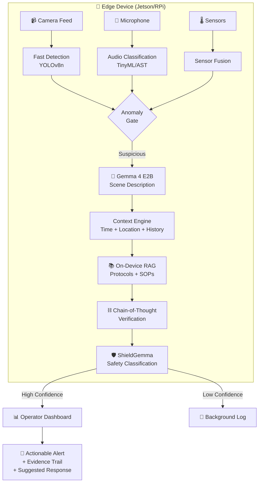

# 🛡️ AI for Public Safety — Deep Research Report
**Google Gemma Hackathon | Track 2**
*Compiled: July 13, 2026*

---

## Executive Summary

This report synthesizes findings from an exhaustive research sweep across arxiv papers, commercial platforms, open-source projects, government deployments, and emerging techniques. The goal: identify **novel, differentiated ideas** for a hackathon project that addresses alarm fatigue, latency, privacy, and the lack of semantic reasoning in public safety monitoring.

> [!IMPORTANT]
> **The single biggest whitespace we found**: No one has built an **edge-first, multimodal safety system that uses chain-of-thought reasoning with open models (Gemma) to provide explainable, forensic-grade alert verification** — all while running offline and preserving privacy. Every commercial solution is cloud-dependent, black-box, and expensive.

---

## 1. Competitive Landscape — What Exists Today

### Commercial Platforms

| Company | What They Do | Fatal Limitation |
|---------|-------------|-----------------|
| **Flock Safety** ($7.5B) | ALPR cameras, gunshot detection, "NightShift" AI assistant | Vehicle-centric, cloud-dependent, $10K+ entry, mass surveillance backlash |
| **Ambient.ai** | "Agentic Physical Security" with VLM (Ambient Pulsar), 95% false alarm reduction | Enterprise-only, proprietary, cloud-dependent, not edge-deployable |
| **SoundThinking** (ex-ShotSpotter) | Acoustic gunshot detection network | Environmental interference, firework false positives, disproportionate deployment in marginalized neighborhoods, no visual context |
| **Evolv Technology** | AI weapons screening at venues | FTC action for misleading claims, high false alarm on everyday items |
| **BriefCam** (Canon) | Video analytics & forensic synopsis | French court ruled it illegal (GDPR), primarily post-incident, not real-time |
| **Actuate AI** | AI camera analytics for threat detection | Commercial/industrial focus, cloud-dependent |
| **Milestone Systems** | Open-platform VMS | Complex, inconsistent 3rd-party quality, no reasoning layer |

### 🔴 Critical Gaps in the Market

| Gap | Why It Matters |
|-----|---------------|
| **No affordable edge-first solution** | Small towns/rural areas priced out ($10K+ vs. our target of <$200 hardware) |
| **All are cloud-dependent** | Latency (seconds vs. milliseconds), privacy risk, fails during disasters |
| **No multimodal reasoning** | Most handle video OR audio, never both with contextual understanding |
| **Black-box decisions** | No explainability — legally and ethically indefensible |
| **No community governance** | All vendor-locked, no open-source production-ready alternative |
| **Context blindness** | Generic models don't adapt (school vs. construction site vs. park) |
| **No temporal reasoning** | Can't distinguish fireworks on July 4th from gunshots |

---

## 2. Cutting-Edge Research — The State of the Art (2024–2026)

### 2.1 Vision-Language Models for Video Anomaly Detection

The field has undergone a **paradigm shift** from reconstruction-based anomaly detection to VLM-powered semantic reasoning:

| Paper/Model | Venue | Key Innovation |
|-------------|-------|----------------|
| **VERA** | CVPR 2025 | Training-free VLM framework; decomposes VAD into reflective guiding questions optimized via verbal VLM-to-VLM interaction |
| **Holmes-VAU** | CVPR 2025 | Hierarchical anomaly understanding (clip → event → video level) with 70k+ multi-granular annotations |
| **LAVAD** | arXiv 2024 | Fully training-free: VLM captions frames → LLM temporally aggregates → anomaly scoring. No weight modification needed |
| **LaGoVAD** | OpenReview 2026 | **Dynamic anomaly definition at inference via natural language** — operators type what to detect, no retraining |
| **HAWK** | NeurIPS 2024 | Interactive VLM with explicit motion modality integration; 8,000+ anomaly videos with language descriptions |
| **Anomaly-OneVision** | CVPR 2025 | Zero-shot specialist with "Look-Twice Feature Matching" (LTFM) — mimics human visual inspection |
| **ASK-Hint** | arXiv 2025 | Action-centric structured prompting for frozen VLMs; semantic groups (violence, public safety, etc.) |
| **Vad-R1-Plus** | arXiv 2026 | "Perception–Cognition–Action Chain-of-Thought" (PerCoAct-CoT) for causal anomaly interpretation |

> [!TIP]
> **LaGoVAD** is a game-changer — it lets operators define anomalies in natural language at runtime. Imagine typing: *"flag anyone climbing the fence near the west gate after 10pm"* and the system just works. No retraining. This is the future.

### 2.2 Explainable & Forensic-Grade AI

| Framework | Key Innovation |
|-----------|---------------|
| **REVEAL** (arXiv 2025) | Chain-of-Evidence via expert models + reinforcement learning optimizing for detection accuracy, explanation fidelity, AND logical coherence — **legally defensible** |
| **AnomalyRuler** (ECCV 2024) | Two-stage induction-deduction: LLM "induces" rules from normal samples → "deduces" anomalies. Few-shot adaptation |
| **TbVAD** (2025) | Structured knowledge slots: Action → Object → Context → Environment → per-slot explanations |
| **Scene Graph Reasoning** (USF 2024) | Root-cause analysis via object relationship graphs |

### 2.3 Edge AI & Small Models

| Model | Size | Edge Capability |
|-------|------|----------------|
| **Gemma 4 E2B** | 2B | Native multimodal (text+image+audio), per-layer embedding, runs via LiteRT-LM on RPi/Jetson |
| **Gemma 4 E4B** | 4B | Same as above with higher reasoning quality |
| **PaliGemma 2** | 3B–28B | Dedicated VLM (SigLIP + Gemma) for detection, captioning, segmentation |
| **ShieldGemma** | Various | Content safety classifier (violence, harmful content) for text + image |
| **Qwen 2.5-VL-2B** | 2B | Sub-second inference on Jetson Orin for robotic perception |

**Key optimization techniques:**
- 4-bit quantization (INT4/NF4) — maintains >98% accuracy while fitting in 5-8GB RAM
- Multi-Token Prediction (MTP) drafters for 2-3x faster inference
- Heterogeneous routing: tiny SLM handles 90%+ routine tasks, complex cases escalate

### 2.4 Audio-Visual Fusion

| Approach | Details |
|----------|---------|
| **Stable Hybrid Cross-Attention** (VideoMAE + AST) | Bidirectional cross-attention for urban safety event recognition |
| **DCASE 2025 Challenge** | Benchmark for rare sounds: gunshots, glass breaking, screams |
| **Ensemble CRNN** (MDPI 2025) | Multi-representation fusion (DCT, Mel spectrograms) for distress sounds |
| **TinyML Audio** | Gunshot detection on ESP32/Cortex-M using milliwatts; >95% accuracy distinguishing from fireworks |
| **Few-shot audio** | MAML + contrastive loss for adapting to new sound classes with minimal examples |

### 2.5 Privacy-Preserving Approaches

| Technique | Application |
|-----------|-------------|
| **Hierarchical Federated Learning + YOLOv8n** (2024) | Multiple edge aggregators, no raw data leaves device |
| **P2VAD Survey** (IEEE TNNLS 2025) | First systematic review of privacy-preserving video anomaly detection |
| **Differential Privacy + Haar wavelets** | Mathematical guarantees against re-identification |
| **On-device anonymization** | Face/body redaction before any data transmission |

### 2.6 Chain-of-Thought Safety Reasoning

| Framework | Innovation |
|-----------|-----------|
| **AD-FM** (AAAI 2026) | Multi-stage reasoning: Region ID → Focused Examination → Decision Making |
| **SafeChain** (ACL 2025) | CoT safety training with ZeroThink/LessThink/MoreThink depth adjustment |
| **PerCoAct-CoT** (2026) | Perception → Cognition → Action reasoning chain for video anomalies |

---

## 3. Novel Ideas That Can Set You Apart

### 🥇 Idea 1: "SafetyChain" — Chain-of-Thought Verification Pipeline

**Concept**: Instead of binary detect/don't-detect, every alert passes through a multi-step reasoning chain that produces an auditable evidence trail:

```
┌─────────────┐    ┌─────────────┐    ┌──────────────┐    ┌─────────────┐    ┌──────────────┐
│  PERCEIVE   │───▶│  DESCRIBE   │───▶│ CONTEXTUALIZE│───▶│   VERIFY    │───▶│    ALERT     │
│ (YOLO/AST)  │    │  (Gemma 4)  │    │ (RAG + KG)   │    │ (Rules +    │    │ (Dashboard + │
│ Fast detect  │    │ NL caption   │    │ Location,    │    │  CoT logic) │    │  evidence)   │
│ of anomaly   │    │ of scene     │    │ time, history│    │             │    │              │
└─────────────┘    └─────────────┘    └──────────────┘    └─────────────┘    └──────────────┘
```

**Why it wins**: Every commercial system stops at step 1 (detect). This adds 4 layers of semantic verification — like giving the AI "System 2 thinking." The reasoning chain becomes forensic evidence.

---

### 🥈 Idea 2: "Acoustic Context Engine" — Environment-Aware Alert Calibration

**Concept**: Before analyzing events, the system classifies **what kind of place this is** using ambient audio:

| Detected Environment | Alert Adjustments |
|----------------------|-------------------|
| School zone (bells, children, PA system) | Heighten sensitivity to aggression, weapons, strangers |
| Construction site (machinery, hammering) | Suppress loud-noise false positives |
| Bar district (music, crowds, bottles) | Raise threshold for shouting, lower for glass breaking patterns |
| Hospital (beeping, announcements) | Focus on aggression, unauthorized access |
| Park (birds, wind, play) | Baseline calm — any anomaly is more significant |

**Plus temporal reasoning**: Calendar-aware (fireworks on Diwali/July 4th → suppress bang alerts by 80%), time-of-day norms (running near school at 3pm = recess, at 3am = suspicious), weather correlation (thunder vs. explosion).

**Why it wins**: No commercial system does this. ShotSpotter famously can't distinguish fireworks from gunshots. This solves it with context, not just better audio models.

---

### 🥉 Idea 3: Dynamic Anomaly Definition via Natural Language

**Concept** (inspired by LaGoVAD): Operators define what's anomalous **in plain English** at runtime:

> *"Alert me if someone is loitering near the ATM for more than 5 minutes after midnight"*
> *"Flag any vehicle driving the wrong way on Oak Street"*
> *"Watch for unattended bags in the terminal"*

The system uses Gemma to parse intent, generate detection rules, and monitor — **no retraining, no ML expertise needed**.

**Why it wins**: Every current system requires custom model training for new scenarios. This democratizes safety monitoring for non-technical operators.

---

### 🏅 Idea 4: On-Device RAG for Crisis Protocol Retrieval

**Concept**: Using Google AI Edge RAG SDK + Gemma to store and retrieve:
- Building floor plans & evacuation routes
- Emergency procedures & SOPs
- Historical incident data for this location
- Contact info for relevant first responders

When an alert triggers, the system automatically retrieves relevant protocols and generates **specific, actionable instructions** — all offline.

**Why it wins**: Works during network outages (exactly when you need it most). First responders get context-aware guidance, not generic alerts.

---

### 🎖️ Idea 5: "Crowd Pulse" — Predictive Crowd Safety

**Concept**: Real-time crowd density monitoring with **predictive** capabilities:
1. YOLO for person detection → density heatmaps
2. ConvLSTM predicts density changes **30-60 seconds ahead**
3. Social Force Model physics for crowd dynamics
4. Graduated alerts: 🟢 Normal → 🟡 Caution → 🟠 Warning → 🔴 Critical
5. AI-generated dynamic evacuation routes via A* pathfinding

**Why it wins**: Crowd crushes (Itaewon 2022, Astroworld 2021) killed hundreds. Current systems only report — this **predicts and prevents**.

---

## 4. The Gemma Advantage — Why This Hackathon Track is Perfect

### Available Gemma Models for This Project

| Model | Role in System |
|-------|---------------|
| **Gemma 4 E2B/E4B** | Core reasoning engine — multimodal (text+image+audio), fits on edge device |
| **PaliGemma 2** | Visual perception — object detection, scene description, visual QA |
| **ShieldGemma** | Violence/threat content classifier — fast safety screening layer |
| **Gemma Scope** | Model interpretability — audit and explain internal decisions |

### On-Device Deployment Stack
```
Hardware:  Raspberry Pi 5 / Jetson Orin Nano (~$100-$250)
Runtime:   LiteRT-LM (GPU/NPU acceleration)
Models:    Gemma 4 E2B (quantized INT4) + ShieldGemma
RAG:       Google AI Edge RAG SDK + Gecko embeddings
Format:    GGUF via llama.cpp or LiteRT native
```

### No One Has Done This Yet
- **"Sixth Sense for Security Guards"** (4th place, Gemma 3n Challenge) was the closest — but used older Gemma 3, no multimodal, no CoT reasoning, no edge RAG
- **No dedicated Gemma-based public safety monitoring pipeline exists** — this is greenfield

---

## 5. Lessons from Deployments & Hackathon Winners

### What Wins Hackathons
1. **Offline-first/edge-native** — judges value resilience over features
2. **Working demos** trump theoretical elegance — show real video being analyzed
3. **Multimodal** (voice + vision + text) beats single-modality every time
4. **Privacy-preserving** approaches increasingly valued
5. **Real-world impact** story — tie to a specific tragedy or problem
6. **Explainability** — show the reasoning, not just the result

### What Failed in Real Deployments

| Failure | Lesson |
|---------|--------|
| Singapore TraceTogether data misuse | Privacy promises must be architecturally enforced, not policy-based |
| NYC AI police reports with hallucinations | LLM outputs in safety contexts need verification chains |
| ShotSpotter accuracy challenges | Single-modality detection is fundamentally limited |
| BriefCam ruled illegal in France | GDPR/privacy compliance must be built-in, not bolted-on |
| Evolv FTC action | Don't overclaim — honest accuracy reporting builds trust |
| Predictive policing bias | Training data reflects historical discrimination — need fairness audits |

---

## 6. Key Research Papers & Resources

### Must-Read Papers
| Paper | Where | Why |
|-------|-------|-----|
| VERA (Verbalized Learning for VAD) | CVPR 2025 | Training-free VLM anomaly detection |
| Holmes-VAU | CVPR 2025 | Hierarchical anomaly understanding |
| LaGoVAD | OpenReview 2026 | Natural language anomaly definition |
| REVEAL | arXiv 2025 | Forensic-grade evidence chains |
| AD-FM | AAAI 2026 | Multi-stage deliberative reasoning |
| P2VAD Survey | IEEE TNNLS 2025 | Privacy-preserving VAD taxonomy |
| SAVANT | arXiv 2025 | Structured semantic reasoning for 7B models |
| SafeChain | ACL 2025 | CoT safety training strategies |
| Vad-R1-Plus | arXiv 2026 | PerCoAct-CoT for causal interpretation |
| HAWK | NeurIPS 2024 | Motion-aware VLM anomaly detection |

### Open-Source Tools
| Tool | Use |
|------|-----|
| [Anomalib](https://github.com/open-edge-platform/anomalib) | Visual anomaly detection library with edge support |
| [Video-Anomaly-Edge](https://github.com/qdrant/video-anomaly-edge) | Edge-to-cloud anomaly pipeline |
| [Google AI Edge RAG SDK](https://ai.google.dev) | On-device RAG for Android/edge |
| [Edge Impulse](https://edgeimpulse.com) | TinyML audio models for MCUs |
| [LocalAI](https://github.com/mudler/LocalAI) | Fully offline AI inference framework |

### Key Datasets
| Dataset | Size | Use |
|---------|------|-----|
| PreVAD | 35,279 videos | Largest VAD dataset with multi-level labels |
| Anomaly-Instruct-125k | 125k pairs | Zero-shot anomaly detection training |
| VAD-Instruct50k | 50k pairs | Anomaly explanation instruction tuning |
| HIVAU-70k | 70k annotations | Hierarchical anomaly understanding |
| DCASE Rare Sound Events | Various | Gunshots, glass breaking, screams |
| AudioSet | 2M+ clips | Large-scale audio event classification |

---

## 7. 🏆 Recommended Hackathon Project: "SafetyChain"

### The Pitch (30-second version)
> *"Current surveillance is a firehose of false alarms that nobody trusts. SafetyChain is an edge-first, privacy-preserving AI system that doesn't just detect — it **reasons**. Using Google Gemma's multimodal capabilities, it processes video and audio entirely on-device, applies chain-of-thought verification with contextual awareness (location, time, environment), and delivers explainable, evidence-backed alerts to operators. Every decision comes with a forensic reasoning trail. It works offline. It costs under $200 to deploy. And it's fully open-source."*

### Architecture



### Core Components

| Component | Technology | Purpose |
|-----------|-----------|---------|
| **Fast Perception** | YOLOv8n + TinyML AST | Sub-100ms object/sound detection — cheap first filter |
| **Scene Reasoning** | Gemma 4 E2B (INT4 quantized) | Natural language scene description + anomaly reasoning |
| **Safety Gate** | ShieldGemma | Fast violence/threat content classification |
| **Context Engine** | Knowledge graph + temporal rules | Location type, time-of-day, calendar, historical patterns |
| **Protocol RAG** | Google AI Edge RAG SDK + Gecko | Retrieve relevant SOPs, floor plans, emergency procedures |
| **CoT Verifier** | Gemma 4 with structured prompting | Multi-step reasoning chain producing auditable evidence |
| **Dashboard** | Web UI (React/vanilla JS) | AI-triaged alerts with evidence, confidence, suggested actions |

### What Makes This Win

| Differentiator | vs. Commercial Solutions |
|----------------|------------------------|
| **Edge-first, offline-capable** | All competitors are cloud-dependent |
| **Explainable reasoning chains** | All competitors are black-box |
| **Multimodal (video + audio + sensors)** | Most handle only one modality |
| **Context-aware (temporal + spatial + environmental)** | None adapt to environment type |
| **Privacy by architecture** | Others are privacy by policy (breakable) |
| **<$200 hardware** | Competitors cost $10K–$100K+ |
| **Open-source, community-governed** | All competitors are vendor-locked |
| **Dynamic anomaly definition in natural language** | All require custom model training |
| **Built on Google Gemma** | Perfect for the hackathon track |

---

## 8. Alternative Project Ideas (If SafetyChain Is Too Ambitious)

### Option A: "CrowdPulse" — Predictive Crowd Safety
- YOLO detection → density heatmaps → ConvLSTM prediction → evacuation routing
- Simpler scope, strong visual demo, ties to Itaewon/Astroworld tragedies
- Uses PaliGemma for scene understanding

### Option B: "ContextGuard" — Acoustic Scene-Aware Monitoring  
- Classify environment type from ambient audio → adjust alert thresholds dynamically
- Solve the fireworks-vs-gunshots problem with temporal + environmental context
- Uses Gemma for reasoning about acoustic events in context

### Option C: "FirstResponder RAG" — Offline Crisis Assistant
- On-device RAG system for first responders with building plans, SOPs, hazmat info
- Voice-activated queries during emergencies, works without internet
- Uses Google AI Edge RAG SDK + Gemma 4 E2B

### Option D: "WatchTower" — Natural Language Safety Rules
- Operators define monitoring rules in plain English
- Gemma parses intent → generates detection logic → monitors in real-time
- "Alert if someone enters the loading dock after 9pm without a reflective vest"
