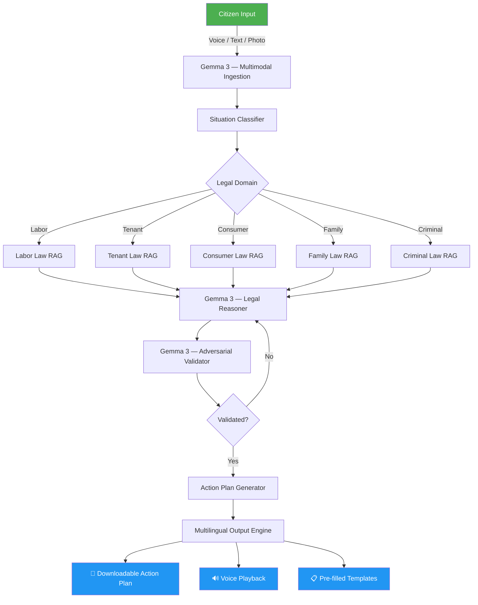

# 🏛️ Gemma Hackathon — Track 1: AI for Legal Assistance
## Comprehensive Research & Novel Idea Exploration

---

## 1. Landscape: What Already Exists

The legal AI assistant space is **crowded but shallow**. Most existing solutions cluster around a few patterns:

| Category | Examples | What They Do |
|---|---|---|
| **Legal Chatbots** | NyayaMitra, ConstitutionGPT, NyayaConnect, LegalSaathi | RAG-based Q&A over legal databases in regional languages |
| **Document Assistants** | LegalEase, VakilAI, Manupatra | Summarize, extract, compare legal documents |
| **Research Platforms** | CoCounsel (Thomson Reuters), Vincent AI (vLex) | Enterprise legal research & drafting |
| **Court Filing Tools** | Litify, Gavel, Clio Draft | Template-based automated document generation |
| **Prediction Platforms** | Pre-Dicta, Lexemo | Litigation outcome prediction using historical data |

> [!IMPORTANT]
> **The Gap:** Almost every existing solution is either (a) built for lawyers, not citizens, (b) English-only or limited multilingual, (c) a simple "chat with a PDF" wrapper, or (d) focused on a single task (e.g., research OR drafting OR prediction). **None delivers a cohesive end-to-end citizen journey** — from "I have a problem" to "Here's what I do next, with the documents to do it."

---

## 2. Research Paper Insights

### Key Academic Findings (2024–2026)

| Theme | Key Insight | Source |
|---|---|---|
| **Multilingual Legal NLP** | Cross-lingual transfer learning + zero-shot can serve low-resource languages with minimal training data | ResearchGate, ACL Anthology |
| **Plain Language Simplification** | GenAI can rephrase legal jargon to "Easy-to-Read" (E2R) but requires human-in-the-loop to preserve legal precision | languageandlaw.eu |
| **RAG for Legal** | RAG + legal knowledge base dramatically reduces hallucination vs. standalone LLM; grounding in verified statutes is non-negotiable | Multiple (arxiv, qed42) |
| **Legal Knowledge Graphs** | Combining LLMs with structured ontologies (deontic logic: rights, duties, obligations) enables explainable, multi-hop legal reasoning | Multiple |
| **Mina (Bangladesh)** | An LLM legal assistant for low-resource environments; passed simulated legal exams at a high level | arxiv.org |
| **ConstitutionGPT** | Integrates RAG + speech tech for multilingual legal responses for Indian citizens | irjmets.com |
| **Trauma-Informed Design** | Legal AI for vulnerable users must detect emotional distress, provide calming UX, and escalate to humans in crisis | Multiple |

---

## 3. Gemma Model Capabilities

### Why Gemma 3 is Ideal for This Track

| Feature | Benefit for Legal Assistant |
|---|---|
| **140+ languages** | True multilingual citizen access out of the box |
| **128K token context** | Can process full statutes, case law, and legal documents |
| **Multimodal (audio, vision)** | Native speech-to-text for voice interaction; OCR for document photos |
| **1B–27B parameter range** | Deployable from mobile (privacy) to cloud (power) |
| **Open weights** | Can fine-tune with LoRA/QLoRA on legal corpora |
| **On-device inference** | Sensitive legal data never leaves the user's device |
| **Function calling** | Agentic workflows: retrieve → reason → act |

> [!TIP]
> **Strategic Choice:** Use **Gemma 3 27B** for the main reasoning engine (cloud/Kaggle), and **Gemma 3 4B/1B** for on-device privacy mode where sensitive data stays local.

---

## 4. What Hackathon Judges Want (2025–2026)

Based on analysis of winning projects (like *CounterClaim Eagle* at LLMxLaw 2025):

| Winning Trait | How to Demonstrate It |
|---|---|
| **Tight scope, solved perfectly** | Don't build "Legal AI Platform" — solve one citizen journey brilliantly |
| **Agentic, not just chat** | Multi-step: classify → retrieve → reason → generate action plan |
| **Trust & auditability** | Every answer cites specific law sections with clickable links |
| **60-second demo** | Value must be obvious within the first minute |
| **Growth path** | Show how it scales to more jurisdictions, languages, use cases |
| **Execution over novelty** | A working demo beats an ambitious pitch deck every time |

---

## 5. 🌟 Novel Ideas That Set You Apart

Here are **5 differentiated concepts**, ordered from most to least novel. Each is designed to be **demonstrable in a hackathon** while having deep intellectual substance.

---

### 💡 Idea A: **"NyayaPath" — The Legal GPS**

**Concept:** Don't just answer questions — **navigate the citizen through their entire legal journey** like a GPS navigates a road trip.

**How it's different:** Every existing tool is a **search engine** ("ask me a question, I'll answer it"). NyayaPath is a **journey engine** — it takes a situation described in plain language, identifies the legal domain, maps out every fork in the road, and generates a **step-by-step action plan with deadlines, documents, and contacts**.

**Architecture:**
```
Citizen's Story (any language, voice/text)
       ↓
[Gemma 3 — Situation Understanding]
  • Classify legal domain (labor, tenant, consumer, family, criminal...)
  • Extract key facts (dates, amounts, relationships, jurisdiction)
  • Detect emotional state (distress, confusion, urgency)
       ↓
[Legal Knowledge Graph + RAG]
  • Map situation to applicable laws (country/state-specific)
  • Identify rights, obligations, deadlines, remedies
  • Build a decision tree of options
       ↓
[Gemma 3 — Adversarial Validation]
  • Second Gemma instance challenges the first's reasoning
  • Catches hallucinations and edge cases
       ↓
[Action Plan Generator]
  • Produces a personalized, downloadable "Legal Action Plan":
    ✅ Your rights (with law section citations)
    ✅ Your options (with pros/cons for each path)
    ✅ Step-by-step next actions with deadlines
    ✅ Pre-filled draft letters/complaints (in user's language)
    ✅ Contact info for relevant legal aid / courts
    ✅ Risk assessment: "What happens if you do nothing"
       ↓
[Multilingual Output]
  • Everything rendered in user's chosen language
  • Voice playback option for low-literacy users
```

**Why it wins:**
- Goes from "chat" to **agentic action planning**
- The **adversarial validation** (two Gemma instances debating) is a novel trust mechanism
- The **downloadable action plan** is a tangible artifact the citizen walks away with
- **"What happens if you do nothing"** creates urgency and demonstrates depth

---

### 💡 Idea B: **"Legal Scenario Sandbox" — What-If Simulator**

**Concept:** Let citizens explore different scenarios interactively. *"What if I refuse to pay the landlord?" → "What if I send a legal notice first?" → "What if I go to consumer court?"*

**How it's different:** Instead of a single answer, the system presents a **branching decision tree** that the citizen can explore. Each branch shows:
- Probability of success (based on similar cases)
- Time investment
- Estimated cost
- Required documents
- Risk factors

**Novel element:** Uses **Monte Carlo-style outcome estimation** by analyzing historical case patterns in the RAG knowledge base — not predicting verdicts, but showing ranges: *"In similar cases in your state, tenants won 72% of the time when they sent a legal notice first."*

---

### 💡 Idea C: **"Voice-First, Privacy-First" — On-Device Legal Companion**

**Concept:** A legal companion that runs **entirely on the user's phone** using Gemma's small models (1B/4B). The user speaks their problem, the model processes it locally, and no sensitive data ever leaves the device.

**How it's different:**
- **Voice-first** interaction serves illiterate and semi-literate populations
- **On-device** inference addresses the #1 concern with legal AI: privacy of sensitive information
- Uses **Gemma's native multimodal capabilities**: user can photograph a legal notice, eviction letter, or court summons and the model reads and explains it
- Syncs with cloud (with consent) only for RAG lookups against anonymized queries

**Why it matters:** In India alone, ~25% of the population is illiterate, yet they still have legal rights. Voice + on-device is the only way to reach them.

---

### 💡 Idea D: **"LegalBridge" — Cross-Jurisdictional Rights Mapper**

**Concept:** Designed for **migrants and refugees** — people who know the law of one country but now live under another. The system maps their rights from their home country to their current location.

**How it's different:** No existing tool helps a Bangladeshi migrant worker in the UAE, or a Ukrainian refugee in Germany, understand how their rights translate. LegalBridge:
- Takes the user's country of origin + current country
- Identifies key legal differences (labor rights, tenancy, family law)
- Highlights rights they might not know they have
- Provides jurisdiction-specific next steps

**Novel element:** **Rights Gap Analysis** — a structured comparison showing what protections exist in their current country vs. their home country, highlighting new rights they've gained.

---

### 💡 Idea E: **"Trauma-Aware Legal AI" — Empathetic Legal Guidance**

**Concept:** A legal assistant that recognizes when the user is describing a traumatic situation (domestic violence, workplace harassment, illegal eviction) and adapts its behavior:
- Switches to **calming, validating language**
- Prioritizes **immediate safety information** before legal advice
- Provides **crisis hotline numbers** before next steps
- Uses **progressive disclosure** (doesn't overwhelm with all options at once)

**Novel element:** **Sentiment-aware response modulation** — the Gemma model is prompted/fine-tuned to detect distress markers in the user's language and adjust its tone, pacing, and information density accordingly.

---

## 6. 🎯 Strategic Recommendation

> [!IMPORTANT]
> ### Go with **Idea A: NyayaPath** as the core, incorporating elements from B, C, and E.

Here's why this combination is the **strongest hackathon submission**:

| Factor | NyayaPath delivers |
|---|---|
| **Tight scope** | One citizen journey: situation → understanding → action plan |
| **Agentic** | Multi-step pipeline with adversarial validation |
| **Multilingual** | Gemma 3's 140+ languages, with voice I/O |
| **Tangible output** | Downloadable PDF action plan with citations |
| **Trust** | Dual-model adversarial check + law section citations |
| **Empathy** | Trauma-aware response modulation (from Idea E) |
| **What-if** | Branching options with risk assessment (from Idea B) |
| **Demo-ability** | 60-second story: "I spoke my problem → Got my rights → Got my action plan" |
| **Gemma showcase** | Uses Gemma 3 multimodal, function calling, multilingual, on-device |

### Suggested Name: **NyayaPath** (न्यायपथ)
*"Nyaya" = Justice, "Path" = Way/Route in Sanskrit/Hindi*
*Tagline: "Your path to justice, in your language."*

---

## 7. Technical Architecture (High-Level)



---

## 8. Key Risks & Mitigations

| Risk | Mitigation |
|---|---|
| **Hallucinated legal citations** | RAG grounded in verified legal databases + adversarial validation |
| **Unauthorized practice of law** | Clear disclaimer: "Legal information, not legal advice" + escalation to human lawyers |
| **Privacy of sensitive data** | On-device inference for sensitive processing; anonymized queries for cloud RAG |
| **Low-resource language quality** | Cross-lingual transfer from English + human-validated legal glossaries |
| **Gemma Prohibited Use Policy** | Legal information ≠ legal advice; add flow-down terms in EULA |

---

## 9. Datasets & Resources to Leverage

| Resource | Use |
|---|---|
| **Indian Kanoon** | Indian case law and statutes for RAG |
| **SCC Online** | Supreme Court and High Court judgments |
| **Bharatiya Nyaya Sanhita (BNS)** | New Indian Penal Code (2023) |
| **EU AI Act / GDPR texts** | For European jurisdictions |
| **UN UDHR** | Universal rights baseline across languages |
| **Hugging Face Legal datasets** | Pre-existing legal QA pairs for fine-tuning |
| **Google Translate API** | Fallback translation for Gemma's 140+ languages |

---

## 10. Competitive Differentiators Summary

What makes our submission **fundamentally different** from the 50+ legal chatbots already built:

1. **Journey, not just Q&A** — End-to-end from problem → action plan
2. **Adversarial dual-model validation** — Two Gemma instances for trust
3. **Tangible output** — Downloadable action plan PDF, not just chat messages
4. **"What happens if you do nothing"** — Risk framing creates urgency
5. **Trauma-aware** — Detects distress and adapts tone
6. **Voice-first + Photo input** — Serves illiterate populations
7. **On-device privacy** — Sensitive facts never leave the phone
8. **Law section citations** — Every claim is traceable to a specific statute
9. **Pre-filled templates** — Draft complaint letters, not just advice
10. **Multilingual by design** — Gemma 3's 140+ languages, not bolt-on translation
