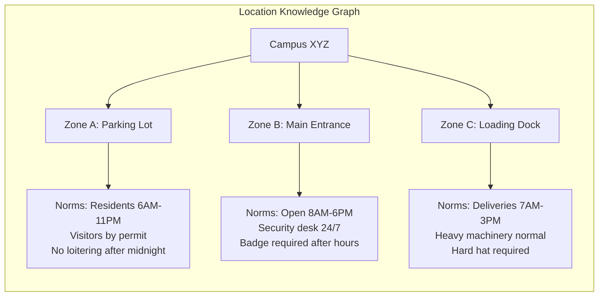

# ⛓️ SafetyChain — Deep Dive Elaboration
## Chain-of-Thought Verification Pipeline for Public Safety

---

## The Core Thesis

> **Every existing safety system answers: "Is this an anomaly?" (Yes/No)**
>
> **SafetyChain answers: "What is happening, why is it suspicious, what context supports or refutes it, how confident am I, and what should you do about it?"**

This is the leap from **System 1** (fast, reflexive, error-prone) to **System 2** (slow, deliberative, trustworthy) — applied to public safety monitoring. The chain-of-thought isn't a feature; it's the **product**.

---

## 1. The 5-Stage Pipeline — Fully Expanded

The pipeline is designed as a **progressive refinement funnel** where each stage adds semantic depth and each stage can **reject the alert** (kill the false positive early):

```
━━━━━━━━━━━━━━━━━━━━━━━━━━━━━━━━━━━━━━━━━━━━━━━━━━━━━━━━━━━━━━━
 STAGE 1         STAGE 2         STAGE 3          STAGE 4         STAGE 5
 PERCEIVE  ───▶  DESCRIBE  ───▶  CONTEXTUALIZE ───▶  VERIFY  ───▶  ACT
 (~20ms)         (~200ms)        (~100ms)          (~300ms)        (~50ms)
━━━━━━━━━━━━━━━━━━━━━━━━━━━━━━━━━━━━━━━━━━━━━━━━━━━━━━━━━━━━━━━

 YOLO/AST         Gemma 4         Knowledge         CoT             Dashboard
 fast filter      scene desc      Graph + RAG       reasoning       + response
 
 "motion at       "Person in       "School zone,     "VERIFY: Is     🟡 MEDIUM
  gate"            dark clothes     3:15 AM,          this a          "Unknown
                   climbing         no scheduled      genuine         person at
                   fence"           maintenance"      intrusion?"     perimeter,
                                                                      notify
                                                                      patrol"
                 ┌──────────┐    ┌──────────────┐   ┌────────────┐
                 │ 70% of   │    │ Another 15%  │   │ Final 10%  │
                 │ false     │    │ killed here  │   │ killed by  │
                 │ positives │    │ by context   │   │ reasoning  │
                 │ die here  │    │              │   │            │
                 └──────────┘    └──────────────┘   └────────────┘
                 
 Only ~5% of raw detections reach the operator → 95% false alarm reduction
━━━━━━━━━━━━━━━━━━━━━━━━━━━━━━━━━━━━━━━━━━━━━━━━━━━━━━━━━━━━━━━
```

---

### Stage 1: PERCEIVE — Fast Detection Layer

**Models:** YOLOv8n (vision) + TinyML AST/CRNN (audio)
**Latency:** <20ms per frame
**Purpose:** Cheap first filter — maximize recall, don't worry about precision

| Modality | What It Detects | Model |
|----------|----------------|-------|
| **Video** | People, vehicles, weapons, fire, falls, running, crowd density | YOLOv8n (INT8 quantized) |
| **Audio** | Gunshots, glass breaking, screams, aggressive speech, explosions | TinyML CRNN on Mel spectrograms |
| **Sensor** | Motion (PIR), temperature spikes, door contacts | Direct GPIO/MQTT |

**Key design decision:** This layer runs **continuously** at full framerate. It's the heartbeat. Everything else is triggered **on-demand** only when this layer flags something.

**Output:** `AnomalyCandidate { type, confidence, bounding_box, timestamp, audio_class }`

**Kill condition:** If confidence < threshold AND no corroborating signals → log silently, don't proceed.

---

### Stage 2: DESCRIBE — Scene Understanding

**Model:** Gemma 4 E2B (multimodal, INT4 quantized)
**Latency:** ~200ms
**Purpose:** Transform raw detection into **natural language scene description**

This is where SafetyChain diverges from every commercial system. Instead of just passing bounding boxes to a classifier, we ask Gemma to **describe what it sees like a witness**.

**Structured Prompt (PerCoAct-inspired):**

```
You are a security observer. Analyze this frame carefully.

PERCEPTION (What do you see?):
- Describe the overall scene/environment
- Identify all people, their approximate age/clothing
- Note their positions, postures, and movements
- Identify all objects, especially anything unusual
- Describe any text visible (signs, license plates)

COGNITION (What does it mean?):
- What activity is taking place?
- Does anything violate expected norms for this setting?
- What is the relationship between the detected objects/people?
- Rate suspiciousness: [NORMAL | UNUSUAL | CONCERNING | ALARMING]

AUDIO CONTEXT (if available):
- Detected sound: {audio_class} at {confidence}%
- Does the sound match or contradict the visual scene?

Output as structured JSON.
```

**Example output:**
```json
{
  "perception": {
    "scene": "Parking lot, nighttime, poorly lit",
    "people": [
      {
        "id": "P1",
        "description": "Adult male, dark hoodie, face partially obscured",
        "position": "Near driver-side door of silver sedan",
        "posture": "Crouching, looking around repeatedly",
        "movement": "Intermittent — pauses, then moves quickly"
      }
    ],
    "objects": [
      {"type": "vehicle", "desc": "Silver sedan, license partially visible: KA-05-..."},
      {"type": "tool", "desc": "Slim metallic object in right hand — possible slim jim or screwdriver"}
    ],
    "text": ["Parking sign: 'Residents Only'"]
  },
  "cognition": {
    "activity": "Possible vehicle break-in attempt",
    "norm_violation": "Person attempting to access vehicle with tool, looking around furtively",
    "relationships": "P1 does not appear to have a key fob; using tool on door lock",
    "suspiciousness": "ALARMING"
  },
  "audio_match": {
    "detected": "metallic_scraping (78%)",
    "visual_match": "CONSISTENT — tool contact with vehicle door"
  }
}
```

> [!TIP]
> **Academic grounding:** This directly implements the **Perception-Cognition** stages from **Vad-R1-Plus** (NeurIPS 2025) and the **structured knowledge slots** from **TbVAD** (Action → Object → Context → Environment).

---

### Stage 3: CONTEXTUALIZE — The Context Engine

**Technology:** Lightweight knowledge graph + temporal rules + on-device RAG
**Latency:** ~100ms
**Purpose:** Ask "Is this *actually* suspicious given where/when/what-has-happened-before?"

This is the **secret weapon** — the stage that kills the most sophisticated false positives.

#### 3.1 Spatial Context (Knowledge Graph)



Each zone has:
- **Expected occupants** (who should be here?)
- **Normal activities** (what should be happening?)
- **Time-based rules** (when do norms change?)
- **Object expectations** (tools ok? vehicles ok?)
- **Historical patterns** (what usually triggers false alarms here?)

#### 3.2 Temporal Context (Calendar + Time + Season)

| Context | Example | Effect |
|---------|---------|--------|
| **Time of day** | Running at 3pm near school = recess; at 3am = suspicious | Threshold adjustment |
| **Day of week** | Weekend loading dock activity = unusual | Elevate alert |
| **Calendar events** | July 4th / Diwali → suppress bang/firework alerts by 80% | False positive prevention |
| **Weather** | Thunder → suppress explosion-like audio; Heavy rain → suppress motion | Environmental filtering |
| **Historical** | "This camera triggers 3x daily from swaying tree branch" | Learned suppression |
| **Seasonal** | Construction season March-October → suppress hammering in Zone C | Baseline adaptation |

#### 3.3 Protocol RAG (On-Device)

Using **Google AI Edge RAG SDK + Gecko embeddings**, stored locally:
- Building floor plans with zone boundaries
- Emergency SOPs for each alert type
- Relevant contact info (security, police, fire, management)
- Evacuation routes per zone
- Regulatory requirements (e.g., OSHA, local fire code)

**Example retrieval:**
```
Query: "Vehicle break-in attempt in Parking Lot after midnight"
Retrieved: 
  → SOP-014: "Vehicle Theft/Break-in Response"
  → Contact: Campus Security Patrol (ext. 2200)
  → Policy: "Do NOT approach suspect; observe and report"
  → Camera: Nearest PTZ cam is CAM-07 (auto-redirect available)
```

> [!IMPORTANT]
> **Academic grounding:** This implements **LaGoVAD**'s idea of dynamic context definition, combined with **scene graph reasoning** from the USF 2024 paper. The knowledge graph encodes semantic relationships that make "a horse on a highway" immediately anomalous without ever training on horse-highway images.

---

### Stage 4: VERIFY — Chain-of-Thought Reasoning

**Model:** Gemma 4 E2B/E4B with structured CoT prompting
**Latency:** ~300ms
**Purpose:** The **deliberative reasoning** stage — this is where SafetyChain earns its name

#### The Reasoning Chain

Inspired by **AD-FM** (AAAI 2026) and **SafeChain** (ACL 2025), the verification uses a **structured reasoning template**:

```
Given the following evidence, perform a systematic verification:

═══ EVIDENCE SUMMARY ═══
Visual: {stage2_output.perception}
Audio: {stage2_output.audio_match}
Context: {stage3_output}

═══ VERIFICATION CHAIN ═══

STEP 1 — EVIDENCE CONSISTENCY
Are the visual and audio signals consistent with each other?
Does the visual evidence match a known anomaly pattern?
Confidence in visual evidence: ___
Confidence in audio evidence: ___

STEP 2 — CONTEXT CHECK
Is this behavior abnormal for this location at this time?
Does the knowledge graph support or refute the anomaly hypothesis?
Are there any known false-positive patterns that match this?
Context verdict: [SUPPORTS_ANOMALY | NEUTRAL | REFUTES_ANOMALY]

STEP 3 — ALTERNATIVE HYPOTHESES
What are 2-3 benign explanations for what's observed?
  Hypothesis 1: ___
  Hypothesis 2: ___
  Hypothesis 3: ___
Can any benign hypothesis fully explain ALL evidence?

STEP 4 — SEVERITY ASSESSMENT
If this IS a genuine anomaly:
  - Threat level: [LOW | MEDIUM | HIGH | CRITICAL]
  - Urgency: [MONITOR | INVESTIGATE | INTERVENE | EMERGENCY]
  - Potential consequences if ignored: ___

STEP 5 — FINAL VERDICT
Based on the above reasoning chain:
  - Classification: [FALSE_POSITIVE | SUSPICIOUS | CONFIRMED_ANOMALY]
  - Confidence: ___% 
  - Recommended action: ___
  - Evidence chain ID: {uuid}
```

#### Example Reasoning Chain Output

```
═══ VERIFICATION CHAIN — ID: sc-2026-07-14-0342-A7f3 ═══

STEP 1 — EVIDENCE CONSISTENCY ✅
Visual evidence shows an individual crouching near a vehicle 
door with a metallic tool. Audio detected metallic scraping at 
78% confidence. These signals are CONSISTENT — the tool 
contact matches the scraping sound. Combined confidence: HIGH.

STEP 2 — CONTEXT CHECK ✅
Location: Parking Lot Zone A, Campus XYZ
Time: 03:42 AM (well outside normal hours 6AM-11PM)
Expected occupancy: NONE (no scheduled events)
Historical: No recurring false positives from this camera angle
Weather: Clear, no environmental factors
Context verdict: STRONGLY SUPPORTS ANOMALY

STEP 3 — ALTERNATIVE HYPOTHESES ⚠️
H1: Owner locked out of own car → POSSIBLE but unlikely at 3:42 AM
    with no resident badge scan in last 2 hours
H2: Maintenance worker → REFUTED by context (no scheduled work, 
    no maintenance uniform visible)
H3: Security patrol → REFUTED (security uses marked vehicles, 
    person has no visible badge/uniform)
None of the benign hypotheses fully explain ALL evidence.

STEP 4 — SEVERITY ASSESSMENT
Threat level: HIGH
Urgency: INVESTIGATE
If ignored: Potential vehicle theft, possible escalation if 
confronted by returning owner

STEP 5 — FINAL VERDICT
Classification: CONFIRMED_ANOMALY
Confidence: 89%
Recommended action: Alert security patrol, auto-redirect 
CAM-07 for secondary angle, DO NOT dispatch without backup
Evidence chain: sc-2026-07-14-0342-A7f3 (preserved for review)
```

> [!TIP]
> **Key insight from SafeChain (ACL 2025):** The depth of reasoning should be **adaptive**. For obvious anomalies (fire, gunshot), use **ZeroThink** (skip reasoning, alert immediately). For ambiguous cases, use **MoreThink** (deeper chain). This adaptive depth keeps latency low for urgent events while maintaining thoroughness for edge cases.

#### Adaptive Reasoning Depth

| Detection Confidence | Severity | Strategy | Reasoning Depth |
|---------------------|----------|----------|-----------------|
| >95% AND critical (fire/weapon/gunshot) | 🔴 CRITICAL | **ZeroThink** | Skip CoT, alert immediately, <50ms |
| >80% AND high | 🟠 HIGH | **LessThink** | Abbreviated 3-step chain, ~150ms |
| 50-80% OR ambiguous | 🟡 MEDIUM | **FullThink** | Complete 5-step chain, ~300ms |
| 30-50% OR novel | ⚪ LOW/UNKNOWN | **MoreThink** | Extended chain + generate multiple hypotheses, ~500ms |

---

### Stage 5: ACT — Operator Dashboard + Response

**Technology:** Web dashboard (React/vanilla JS + WebSocket)
**Purpose:** Present the verified alert with full evidence trail and actionable instructions

#### Dashboard Layout

```
┌──────────────────────────────────────────────────────────────┐
│  SafetyChain Dashboard                    🟢 System Online   │
├──────────────┬──────────────────────┬────────────────────────┤
│              │                      │                        │
│  ALERT FEED  │   LIVE VIEW          │  REASONING CHAIN       │
│              │                      │                        │
│  🔴 03:42    │  [Camera Feed]       │  ✅ Evidence:          │
│  Vehicle     │  [Annotated boxes    │    Visual + Audio      │
│  Break-in    │   highlighting       │    match (89%)         │
│  Zone A      │   person + tool]     │                        │
│  89%         │                      │  ✅ Context:           │
│              │  [Secondary angle    │    After hours, no     │
│  🟡 03:15    │   from CAM-07]       │    scheduled activity  │
│  Loitering   │                      │                        │
│  Zone B      │                      │  ⚠️ Alt hypotheses:   │
│  62%         │                      │    Owner lockout       │
│  (resolved)  │                      │    (unlikely — no      │
│              │                      │     badge scan)        │
│              │                      │                        │
│              │                      │  📋 Recommendation:    │
│              │                      │    Alert patrol,       │
│              │                      │    redirect CAM-07,    │
│              │                      │    do NOT approach     │
│              │                      │    alone               │
│              │                      │                        │
│              │                      │  📄 SOP-014 loaded     │
│              │                      │  📞 Patrol: ext 2200   │
├──────────────┴──────────────────────┴────────────────────────┤
│ [✅ Acknowledge] [🔍 Investigate] [❌ Dismiss] [📝 Report]   │
└──────────────────────────────────────────────────────────────┘
```

#### What the Operator Gets

| Element | Description |
|---------|-------------|
| **Annotated frames** | Bounding boxes, object labels, motion vectors overlaid on live feed |
| **Reasoning chain** | Full step-by-step verification, collapsible, with ✅/❌ per step |
| **Confidence score** | Overall + per-evidence-source breakdown |
| **Alternative hypotheses** | "It could also be..." — builds trust through transparency |
| **Recommended action** | Specific, drawn from RAG-retrieved SOPs |
| **Relevant contacts** | Auto-populated from knowledge graph |
| **Evidence package** | One-click export of frames, reasoning, timestamps → forensic report |
| **Feedback buttons** | Operator marks True Positive / False Positive → system learns |

---

## 2. Novel Sub-Features That Elevate SafetyChain

### 2.1 🧠 Anomaly Memory — Learning from Feedback

```
Operator marks alert as False Positive
       ↓
System records: {scene_description, context, reasoning_chain, verdict: FP}
       ↓
Knowledge graph updated: "Swaying tree branch at Camera 3 = recurring FP"
       ↓
Next occurrence: Stage 3 context check catches it instantly
       ↓
Result: Alert suppressed, logged as "known environmental pattern"
```

This **feedback loop** is what makes SafetyChain get **smarter over time**. No retraining needed — it's pure knowledge graph enrichment.

### 2.2 🎤 Acoustic Scene Fingerprinting

Before analyzing specific sounds, the system builds an **ambient acoustic profile** for each zone:

```
Zone A (Parking Lot):
  Baseline: Traffic hum (45dB), occasional car doors, distant conversations
  Time-variant: Quieter after 11pm, louder during rush hours
  
Zone B (School Corridor):
  Baseline: Children's voices (65dB), bells every 40 minutes, PA announcements
  Time-variant: Silent after 4pm, completely silent after 6pm
```

Any sound event is measured **against the zone's acoustic fingerprint**, not against a universal threshold. A door slam in a quiet parking lot at 3am is significant; in a school corridor at noon, it's invisible.

### 2.3 📊 Multi-Camera Correlation

When one camera detects an anomaly, SafetyChain **automatically checks adjacent cameras** for corroborating evidence:

```
Camera 3 detects: Person running
       ↓
System checks: Camera 2 (30 seconds earlier) — same person walking normally?
               Camera 4 (coverage overlap) — different angle confirmation?
               Camera 5 (next expected location) — anticipatory tracking
       ↓
Result: Corroborated across 2 cameras → confidence boost (+15%)
    OR: No corroboration → possible camera artifact → confidence penalty (-20%)
```

### 2.4 🗣️ Natural Language Rule Definition (LaGoVAD-inspired)

Operators can define custom detection rules without any ML knowledge:

```
Operator types: "Alert me if anyone enters the loading dock 
                 without a reflective vest after 7am"

Gemma parses → Detection rule:
{
  "zone": "loading_dock",
  "trigger": "person_detected",
  "condition": "NOT wearing_reflective_vest",
  "time_window": "07:00-23:59",
  "severity": "MEDIUM",
  "action": "alert_supervisor"
}

System monitors → Rule active in real-time → No retraining
```

### 2.5 📈 Escalation Intelligence

Not all anomalies are equal. SafetyChain uses **graduated escalation**:

| Level | Trigger | Response |
|-------|---------|----------|
| 🟢 **LOG** | Low confidence, known pattern | Silent log, available for review |
| 🟡 **NOTIFY** | Medium confidence, unusual but not threatening | Dashboard notification, no sound |
| 🟠 **ALERT** | High confidence, potential threat | Audio alert, dashboard priority, auto-record |
| 🔴 **EMERGENCY** | Critical — weapon/fire/active threat | Strobe + siren, auto-call dispatch, lock relevant doors |

### 2.6 ⚖️ Bias Audit Trail

Every alert includes a **fairness check**:

```
BIAS AUDIT for alert sc-2026-07-14-0342-A7f3:
  ✅ Alert based on: behavior (crouching, tool use, furtive movement)
  ✅ NOT based on: race, gender, age, clothing style alone
  ✅ Same behavior in same context would trigger regardless of person's demographics
  📋 Audit ID: ba-2026-07-14-0342-A7f3 (preserved for review)
```

This is **critical** for avoiding the pitfalls of predictive policing bias and for legal defensibility.

---

## 3. Concrete Demo Scenarios

### Scenario 1: Vehicle Break-in (HIGH confidence)
```
Camera → Person crouching at car door with tool at 3AM
Audio  → Metallic scraping
Context → After hours, no badge scan, no scheduled maintenance
Chain  → FullThink → 89% confidence → ALERT
Output → "Possible vehicle break-in, Zone A, alert patrol"
```

### Scenario 2: Fireworks vs Gunshots (Context-resolved)
```
Audio  → Loud bangs (75% gunshot, 70% firework)
Calendar → July 4th
Context → Residential area, multiple sources, no visual threat
Chain  → FullThink → alternative hypothesis: "Holiday fireworks" wins
Output → LOG (suppressed) — "Bangs consistent with fireworks, July 4th"
```

### Scenario 3: School Intrusion (CRITICAL — ZeroThink)
```
Camera → Unknown adult, no badge, jumping fence at school perimeter
Audio  → None significant
Context → School hours, children present, restricted zone
Chain  → ZeroThink — skip reasoning, EMERGENCY
Output → IMMEDIATE: "Unauthorized perimeter breach, school zone, dispatch now"
```

### Scenario 4: Construction Worker False Positive
```
Camera → Person swinging metal object
Audio  → Repeated banging
Context → Construction zone, 10AM weekday, hard hat visible
Chain  → Stage 3 context kills it: "Construction zone, normal activity"
Output → SUPPRESSED — never reaches operator
```

### Scenario 5: Loitering Escalation
```
Camera → Person standing near ATM for 2 minutes → 5 minutes → 10 minutes
Audio  → Phone conversation (normal)
Context → Business hours, ATM is functional, person appears to be on phone
Chain  → FullThink at 5min → LOG (phone call explanation)
         FullThink at 10min → NOTIFY (unusually long, check if ATM issue)
         FullThink at 15min → ALERT (loitering threshold exceeded)
Output → Graduated response matching escalation
```

### Scenario 6: Package Abandonment
```
Camera → Bag placed on bench → person walks away → 3 minutes → 5 minutes
Audio  → Normal ambient
Context → Transit station, high-traffic time, bag remains stationary
Chain  → MoreThink at 3min: "Monitor — person may return"
         FullThink at 5min: "Unattended object, transit zone, elevated risk"
Output → ALERT — "Unattended bag, Platform 3, investigate per SOP-009"
```

### Scenario 7: Multi-Sensor Corroboration (Night Fight)
```
Camera  → Two people facing each other, aggressive postures
Audio   → Shouting, glass breaking (82%)
Sensor  → Vibration spike from nearby glass panel sensor
Context → Bar district, 1:30 AM Saturday
Chain   → FullThink → 3 modalities corroborate → 94% confidence
Output  → ALERT — "Physical altercation with glass breakage, Zone D"
         + SOP: "Alert police, do not intervene, preserve camera footage"
```

---

## 4. Technical Stack — Complete Specification

### Hardware
```
Primary:   NVIDIA Jetson Orin Nano ($199) — 40 TOPS, 8GB RAM
           OR Raspberry Pi 5 ($80) + Hailo-8L ($30) — 13 TOPS
Camera:    Any IP camera (RTSP) or USB camera
Audio:     USB microphone array OR I2S MEMS mic (INMP441)
Optional:  PIR sensor, door contacts, temperature sensor via GPIO
```

### Software Stack
```
┌─────────────────────────────────────────────────┐
│                SAFETCHAIN RUNTIME                │
├─────────────────────────────────────────────────┤
│ Dashboard       │ React/Vanilla JS + WebSocket   │
│ API Layer       │ FastAPI (Python)                │
│ CoT Engine      │ Gemma 4 E2B via LiteRT-LM      │
│ Scene Describer  │ Gemma 4 E2B (multimodal)       │
│ Safety Gate     │ ShieldGemma (content filter)    │
│ Object Detector │ YOLOv8n via ONNX Runtime        │
│ Audio Detector  │ TinyML CRNN on Mel spectrograms │
│ RAG Engine      │ Google AI Edge RAG SDK + Gecko   │
│ Knowledge Graph │ SQLite + custom graph layer      │
│ Message Bus     │ MQTT (Mosquitto)                 │
│ Video Pipeline  │ GStreamer + OpenCV               │
└─────────────────────────────────────────────────┘
```

### Model Budget (on Jetson Orin Nano — 8GB RAM)

| Model | Size (INT4) | RAM | Inference |
|-------|-------------|-----|-----------|
| YOLOv8n | 3.2MB | ~50MB | 8ms/frame |
| TinyML Audio CRNN | 1.5MB | ~20MB | 5ms/chunk |
| Gemma 4 E2B (INT4) | ~1.2GB | ~2.5GB | 200ms |
| ShieldGemma (small) | ~500MB | ~1.2GB | 80ms |
| Gecko Embeddings | ~100MB | ~300MB | 10ms/query |
| **Total** | | **~4.1GB** | **Fits in 8GB** ✅ |

---

## 5. What Makes This a Hackathon Winner

### The "60-Second Demo" Script

1. **0-10s:** Show a live camera feed with SafetyChain running. "This is a $200 edge device analyzing video and audio in real-time."
2. **10-25s:** Trigger a test scenario (person approaching fence). Watch the pipeline light up: PERCEIVE ✅ → DESCRIBE ✅ → CONTEXTUALIZE ✅ → VERIFY ✅ → ACT ✅
3. **25-40s:** Show the reasoning chain expanding on the dashboard. "See how it considered 3 alternative hypotheses before deciding this was real?"
4. **40-50s:** Show a false positive being automatically suppressed. "The fireworks on July 4th? Automatically suppressed by temporal context."
5. **50-60s:** "This runs offline. No cloud. No subscription. Privacy by architecture. Open source."

### Differentiator Matrix vs. Competition

| Feature | Ambient.ai | Flock Safety | ShotSpotter | SafetyChain |
|---------|-----------|-------------|------------|------------|
| Edge-first | ❌ Cloud | ❌ Cloud | ❌ Cloud | ✅ 100% edge |
| Explainable | ❌ Black box | ❌ Black box | ❌ Black box | ✅ Full CoT chain |
| Multimodal | 🟡 Video only | 🟡 ALPR only | 🟡 Audio only | ✅ Video + Audio + Sensor |
| Context-aware | ❌ | ❌ | ❌ | ✅ Time + Space + History |
| Works offline | ❌ | ❌ | ❌ | ✅ Fully offline |
| Cost | $$$$$$ | $$$$$ | $$$$$ | 💲 (<$200) |
| Open source | ❌ | ❌ | ❌ | ✅ |
| Privacy | ❌ Cloud | ❌ Cloud | ❌ Cloud | ✅ On-device |
| NL rule definition | ❌ | ❌ | ❌ | ✅ |
| Bias audit | ❌ | ❌ | ❌ | ✅ |

---

## 6. Research Papers Directly Informing Each Stage

| Stage | Inspired By | Key Technique Borrowed |
|-------|------------|----------------------|
| 1 — PERCEIVE | YOLO + DCASE 2025 | Fast multi-modal first filter |
| 2 — DESCRIBE | **Vad-R1-Plus** (NeurIPS 2025), **TbVAD** | PerCoAct-CoT (Perception-Cognition-Action) structured prompting |
| 3 — CONTEXTUALIZE | **LaGoVAD** (OpenReview 2026), Scene Graph Reasoning (USF 2024) | Dynamic anomaly definition via language, knowledge graph context |
| 4 — VERIFY | **AD-FM** (AAAI 2026), **SafeChain** (ACL 2025), **REVEAL** (2025) | Multi-stage deliberative reasoning, ZeroThink/MoreThink depth, chain-of-evidence |
| 5 — ACT | **VERA** (CVPR 2025), XAI Dashboard Research | Verbalized explanations, SHAP-style feature attribution |
| Feedback Loop | **AnomalyRuler** (ECCV 2024) | Induction-deduction: learn rules from operator corrections |
| Overall | **AVA-GRPO** (Vad-R1) | Self-verification with reinforcement learning for reasoning quality |

---

## 7. Stretch Goals (if time permits)

| Feature | Complexity | Impact |
|---------|-----------|--------|
| **Crowd density prediction** (ConvLSTM, 30s ahead) | Medium | Prevent crowd crushes |
| **PTZ camera auto-redirect** (ONVIF control) | Low | Auto-zoom on anomaly for detail |
| **Multi-node federation** | High | Multiple SafetyChain nodes share knowledge without raw data |
| **Mobile companion app** | Medium | Push alerts to security guard's phone |
| **Voice commands** | Low | "SafetyChain, show me the last alert in Zone B" |
| **Incident timeline** | Low | Auto-generate chronological event report for post-incident review |

---

## 8. Open Questions for Your Team

> [!IMPORTANT]
> Before implementation, decide on these:

1. **Primary demo scenario:** Which scenario do you want to showcase? Vehicle break-in is the most dramatic, but school intrusion shows the ZeroThink fast-path better.

2. **Hardware target:** Jetson Orin Nano ($199, more power) vs. RPi 5 + Hailo ($110, cheaper narrative)?

3. **Scope:** Full 5-stage pipeline, or focus on Stages 2-4 (the reasoning chain) and mock Stages 1 and 5?

4. **Audio or not:** Multimodal (video+audio) is a huge differentiator but adds complexity. Worth it for the hackathon?

5. **Dashboard fidelity:** Polished UI or functional prototype? Judges value working demos, but a beautiful dashboard creates emotional impact.
