# ⛓️ SafetyChain — System Architecture

---

## 1. High-Level System Architecture

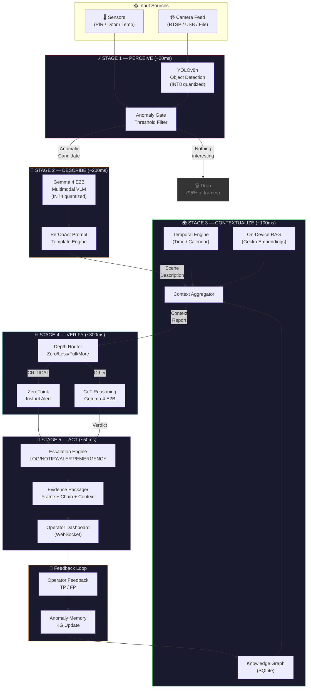

---

## 2. Data Flow — Inter-Stage Communication

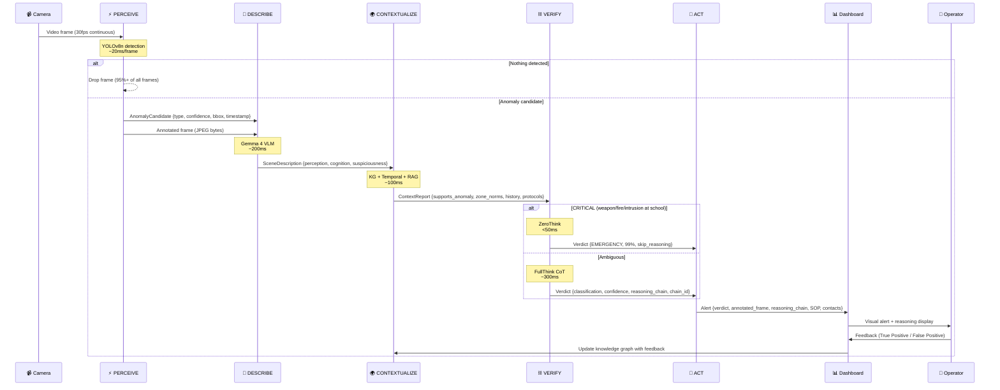

---

## 3. Stage 1 — PERCEIVE: Detection Architecture

```mermaid
graph LR
    subgraph "Frame Ingestion"
        SRC["Video Source<br/>(RTSP/USB/File)"]
        DEC["Frame Decoder<br/>(OpenCV)"]
        BUF["Frame Buffer<br/>(Ring Buffer, 30 frames)"]
    end

    subgraph "Object Detection"
        YOLO["YOLOv8n<br/>(ONNX Runtime, INT8)"]
        CLASSES["Class Filter<br/>person, vehicle, weapon,<br/>fire, backpack, knife"]
    end

    subgraph "Anomaly Gate"
        THRESH["Confidence Threshold<br/>(configurable per class)"]
        ZONE_CHK["Zone Boundary Check<br/>(is detection in monitored area?)"]
        MOTION["Motion Delta<br/>(frame diff for rapid changes)"]
        DECIDE{Pass?}
    end

    SRC --> DEC --> BUF
    BUF --> YOLO --> CLASSES
    CLASSES --> THRESH
    THRESH --> ZONE_CHK
    ZONE_CHK --> MOTION
    MOTION --> DECIDE

    DECIDE -->|"Yes"| OUT["AnomalyCandidate<br/>→ Stage 2"]
    DECIDE -->|"No"| LOG["Silent Log<br/>(for forensic review)"]

    style OUT fill:#e94560,color:#fff
    style LOG fill:#333,color:#888
```

---

## 4. Stage 2 — DESCRIBE: VLM Scene Understanding

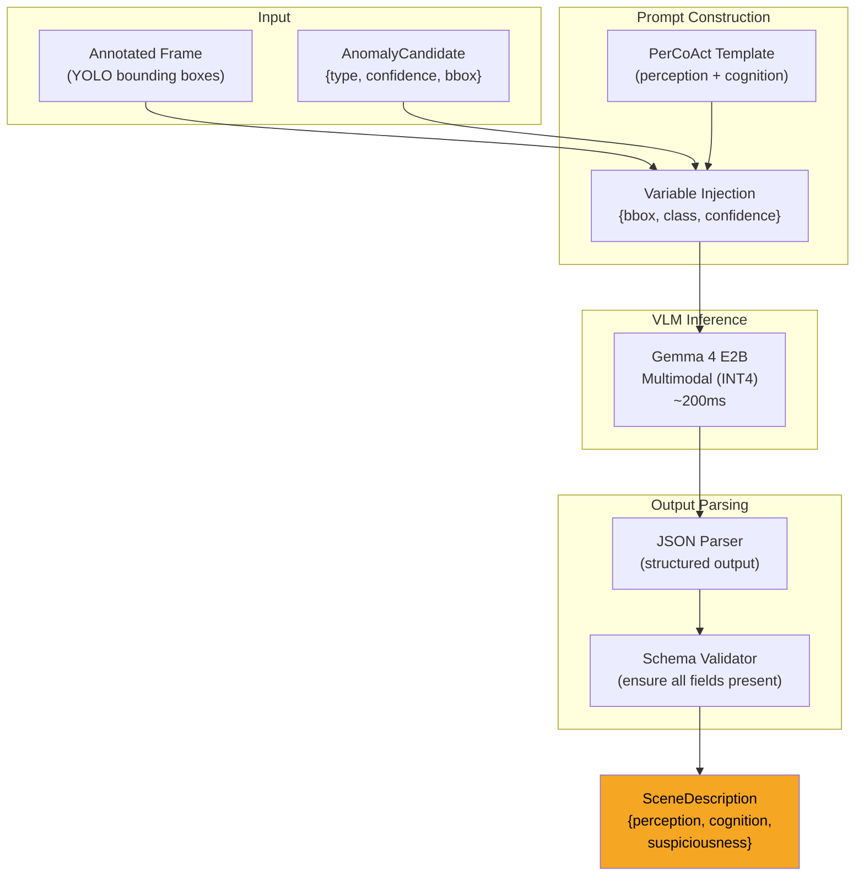

### PerCoAct Prompt Structure

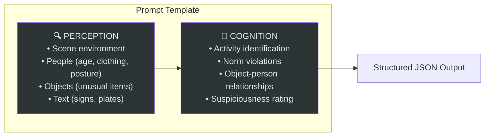

---

## 5. Stage 3 — CONTEXTUALIZE: Knowledge Graph & Context Engine

### Knowledge Graph Schema

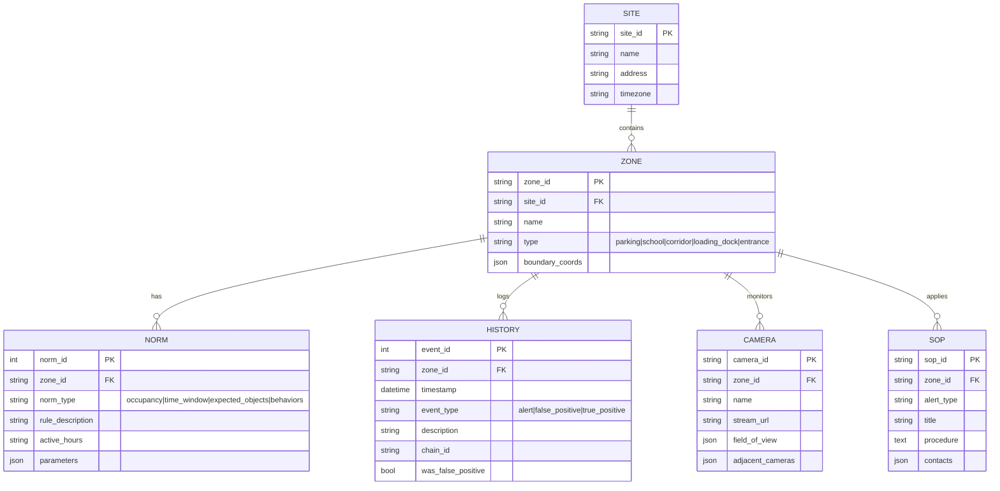

### Context Aggregation Flow

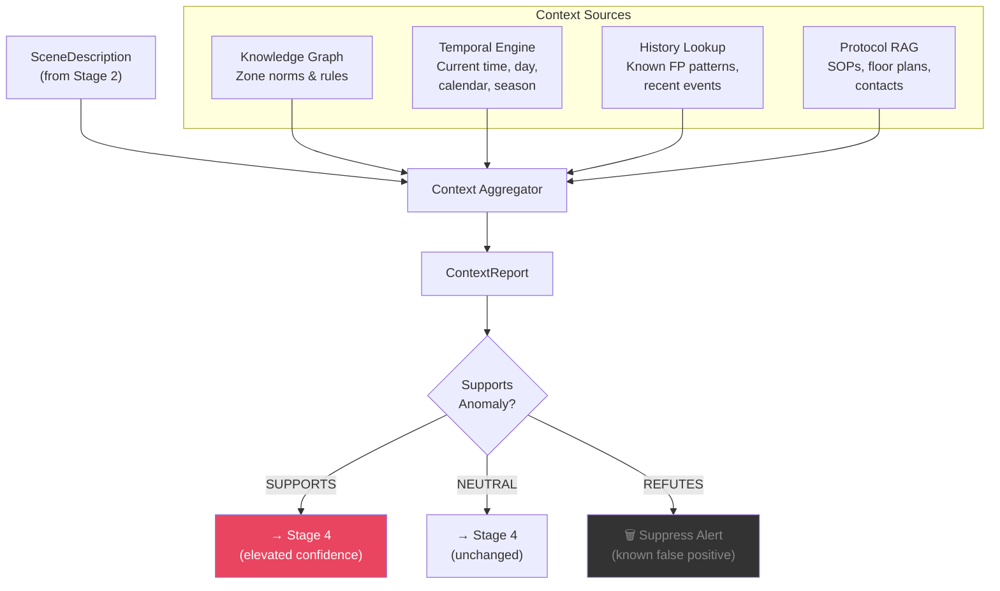

---

## 6. Stage 4 — VERIFY: Adaptive CoT Reasoning

### Reasoning Depth Router

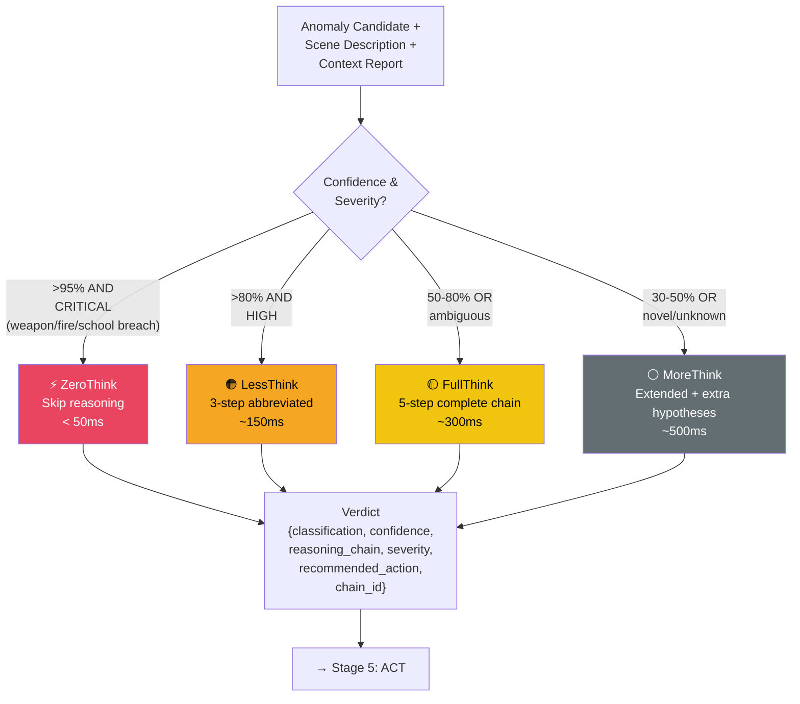

### FullThink 5-Step Chain

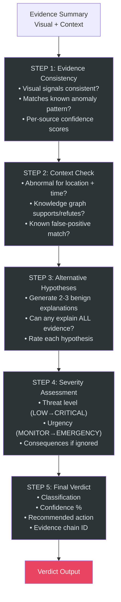

---

## 7. Stage 5 — ACT: Alert Escalation State Machine

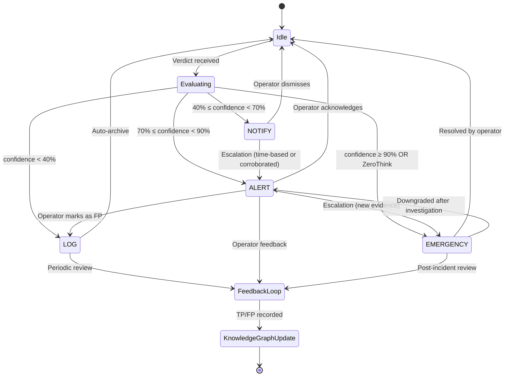

---

## 8. Anomaly Memory — Feedback Loop Architecture

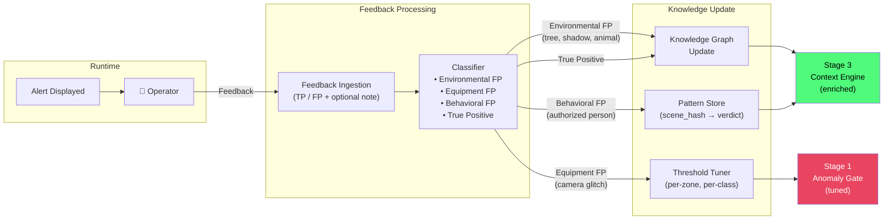

---

## 9. Deployment Architecture — RPi 5 Edge Device

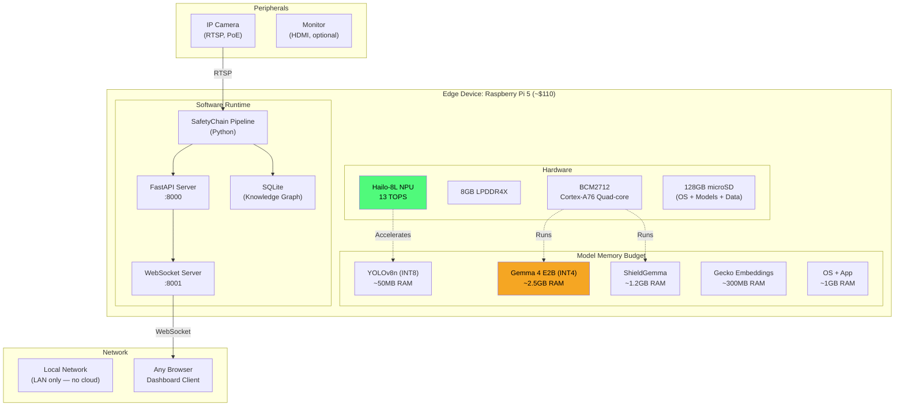

### Memory Budget Breakdown

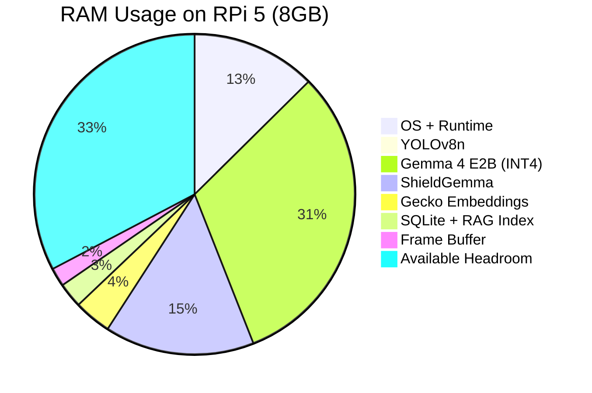

---

## 10. Dashboard Component Architecture

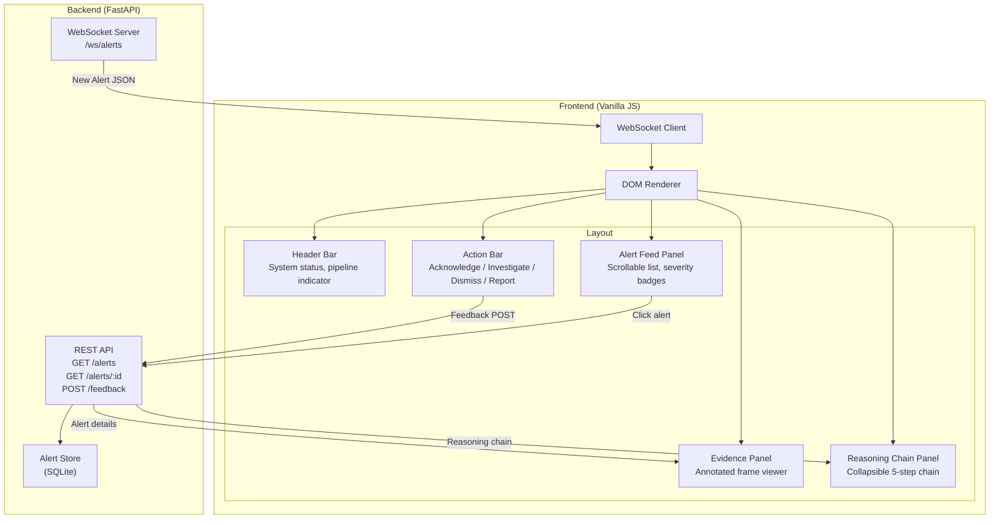

---

## 11. End-to-End Latency Budget

```mermaid
gantt
    title Pipeline Latency Budget (target: <700ms total)
    dateFormat X
    axisFormat %L ms

    section Stage 1
    YOLO Detection        :s1, 0, 20
    Anomaly Gate           :s1g, 20, 5

    section Stage 2
    Frame Encoding         :s2a, 25, 10
    Gemma VLM Inference    :s2b, 35, 200
    JSON Parsing           :s2c, 235, 5

    section Stage 3
    KG Query               :s3a, 240, 20
    Temporal Check         :s3b, 240, 10
    RAG Retrieval          :s3c, 240, 50
    Context Aggregation    :s3d, 290, 10

    section Stage 4
    Depth Routing          :s4a, 300, 5
    CoT Reasoning (Gemma)  :s4b, 305, 300
    Verdict Generation     :s4c, 605, 10

    section Stage 5
    Escalation Logic       :s5a, 615, 5
    Evidence Packaging     :s5b, 620, 20
    WebSocket Push         :s5c, 640, 10

    section Total
    End-to-end             :total, 0, 670
```

> [!NOTE]
> Stages 3a, 3b, 3c run **in parallel** (async). The Gantt shows wall-clock time.
> ZeroThink path skips Stages 2-4 and completes in **<70ms**.
